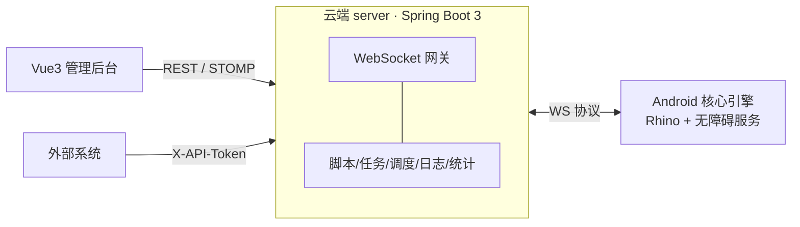

# JavaRPA — 云端脚本管理与设备控制系统

云端统一管理 Android 设备上的自动化脚本：脚本热更新（免重装 APK）、任务远程启停、灰度发布与回滚、实时日志与数据统计、开放 API。



## 目录结构

| 目录 | 说明 | 构建 |
|------|------|------|
| `server/` | 云端管理平台（Spring Boot 3.2 + MyBatis-Plus + MySQL + Redis） | `mvn package` |
| `android/` | 设备端核心引擎 App（Rhino JS + AccessibilityService） | `./gradlew assembleDebug` |
| `web/` | 管理后台（Vue3 + Element Plus + ECharts） | `npm run build` |
| `docs/protocol.md` | 设备端 WebSocket 消息协议 | - |
| `docs/script-development.md` | **业务脚本开发指南**（JS API / 调试流程 / 约束） | - |
| `examples/demo-script/` | 示例脚本（计算器自动点按） | zip 打包后上传 |
| `tools/e2e.sh` | 端到端联调脚本（mock 设备模拟全链路） | `bash tools/e2e.sh` |

## 快速开始

### 1. 基础设施

```bash
docker compose up -d   # MySQL 8 + Redis 7（仅绑定 127.0.0.1；Redis 默认密码 rpa_redis_dev）
```

存量数据卷升级说明：Redis 加了密码，MySQL 新增应用账号 `rpa`（仅首次初始化卷时创建），
存量卷沿用原账号即可（服务端默认 `root/root123456`，可用环境变量覆盖）。

### 2. 云端

```bash
cd server
# 首次启动自动建表并创建管理员 admin；密码用 RPA_ADMIN_PASSWORD 预设（本地联调示例），
# 未预设则随机生成且日志只显示前 4 位（更安全，可用 RPA_ADMIN_PASSWORD 重置环境验证）
RPA_ADMIN_PASSWORD=admin123 mvn spring-boot:run -Dspring-boot.run.profiles=dev    # 默认 8080
```

> 安全约束：未声明 `dev/local/test` profile 时若使用默认 JWT 密钥将**拒绝启动**。
> 生产部署必须设置 `RPA_JWT_SECRET`（≥32 字节随机串），跨域白名单用 `RPA_CORS_ORIGINS` 覆盖，
> Redis 密码用 `REDIS_PASSWORD`、数据库账号用 `MYSQL_USER/MYSQL_PASSWORD` 覆盖。

### 3. 管理后台

```bash
cd web
npm install
npm run dev            # http://localhost:5173 （代理到 8080）
```

### 4. 设备端（真机）

```bash
cd android && ./gradlew assembleDebug
adb install app/build/outputs/apk/debug/app-debug.apk
```

App 内操作：
1. 后台「设备管理」→ 添加设备，记录 deviceSn / secret（仅显示一次）
2. App 填写服务器地址（如 `http://<电脑IP>:8080`）、deviceSn、secret → 启动引擎
3. 系统设置中开启「RPA 自动化服务」无障碍权限

### 5. 发布脚本并调度

1. 「脚本管理」→ 新建 → 上传版本（zip，根目录须含 `main.js` + `config.json`）→ 发布（全量/灰度/分组）
2. 「任务管理」→ 新建任务（绑定脚本版本与设备，可配置 CRON 定时、失败重试、JSON 参数）
3. 一键启动/暂停/停止/重启，设备详情页可实时查看日志（STOMP 推送）

## 脚本 JS API（设备端沙箱内可用）

```js
// 选择器
auto.text("登录").findOne(5000)      // 按文本找控件，5s 超时，返回 Node 或 null
auto.id("btn_ok").find()             // 按 viewId 后缀
node.click(); node.input("hello"); node.text(); node.rect()
auto.clickText("登录")               // 快捷：按文本查找并点击
// 手势
auto.tap(x, y); auto.swipe(x1,y1,x2,y2,ms); auto.back(); auto.home()
auto.launch("com.android.calculator2")
// 截图/找色/找图（Android 11+，适用于游戏自绘界面）
var img = auto.screenshot()
var p = img.findColor("#FF4444", 10)      // → {x,y} | null
var h = img.findImage("res/btn.png", 8)   // 模板找图（模板随脚本包分发）
if (p) auto.tap(p.x, p.y)
// 任务参数（创建任务时配置的 JSON）
log("参数:", JSON.stringify(params))
// 业务计数（上报云端统计）
auto.report.ok(); auto.report.fail()
// 生命周期
sleep(1000); auto.waitIfPaused(); auto.stop()
device.width; device.height; device.getInfo()
```

沙箱通过 Rhino `ClassShutter` 禁止访问 `java.*`（含 Runtime/反射），仅暴露上述 API。

## 核心机制

- **热更新**：发布 → 在线设备立即推送 `CMD_UPDATE_SCRIPT`；离线设备重连注册时按最新发布策略（含灰度命中）补推。设备端按 `scripts/{scriptId}/{versionCode}/` 多版本共存，MD5 校验 + zip-slip 防护。
- **灰度/回滚**：发布目标支持 ALL / GROUP(分组) / PERCENT(按 deviceSn 哈希稳定命中)；回滚 = 将旧版本以全量方式重新发布。
- **任务控制**：启动/暂停（协作式，脚本阻塞于 `auto.waitIfPaused`）/停止（中断线程）/重启；失败按 `maxRetries` 自动重发；离线设备指令进入 Redis 待发队列，重连后补发。
- **离线检测**：连接关闭即时下线 + 心跳超时 90s 扫描兜底。
- **统计**：`task_execution` 记录每次执行，`stats_daily` 每日凌晨预聚合，仪表盘/报表实时计算当日。

## API

- 管理接口：后台全部功能均有 REST 实现（JWT Bearer），文档见 `http://localhost:8080/swagger-ui.html`
- 开放接口：`/open/v1/**`，请求头 `X-API-Token`（后台「API Token」页创建），提供设备/任务/脚本/统计能力
- MCP：`tools/mcp-server/mcp-server.mjs`（零依赖 Node ≥18），让 AI 编程助手直接写脚本→部署→跑日志闭环调试，配置与用法见 `docs/mcp.md`，工作区已内置 `.vscode/mcp.json`

## 安全清单

管理员 BCrypt + JWT；设备 deviceSn+secret 握手鉴权（脚本下载同样鉴权）；API Token 仅存 SHA-256 哈希；脚本包 MD5 校验 + 上传 zip 结构白名单校验；Rhino 沙箱禁反射逃逸；SQL 全参数化；上传大小限制 50MB。

## 已知边界（后续演进）

- 离线补发队列依赖 Redis；Redis 不可用时自动降级（仅跳过补发，不影响在线链路）
- 万级设备规模建议演进 MQTT/Netty 网关与 ClickHouse 日志存储（当前架构预留了协议与服务边界）
- 设备保活采用前台服务 + 电池白名单引导，未做厂商 ROM 深度适配
